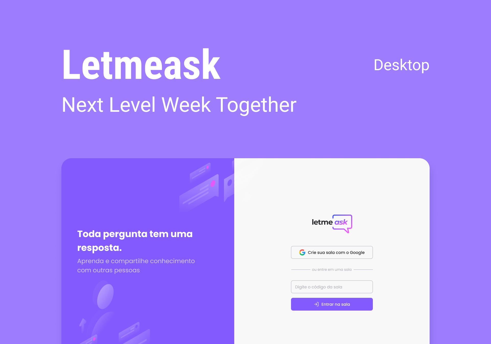

<h1 align="center">
  <br>Letmeask<br/>
  ReactJS | Firebase | TypeScript
  <br/>
  <br/>
  
  <br/>
  <a href="https://wakatime.com/badge/user/920a7e43-2969-4212-82ff-1b375685ff58/project/018d325e-ed35-4e28-ace4-7bc880ff775b">
    
  </a>
</h1>

<p align="center">
  
  
  
  <br/>
</p>

<p align="center">
  <a href="#bookmark-about-the-project">About</a>&nbsp;&nbsp;&nbsp;|&nbsp;&nbsp;&nbsp;
  <a href="#rocket-technologies">Technologies</a>&nbsp;&nbsp;&nbsp;|&nbsp;&nbsp;&nbsp;
  <a href="#boom-how-to-execute">How to Execute?</a>&nbsp;&nbsp;&nbsp;|&nbsp;&nbsp;&nbsp;
  <a href="#memo-license">License</a>
</p>

## :bookmark: About the Project

The **Letmeask** is a web application that does questions about many subjects in real time between admin and users.

This app was developed in **NLW Together**, the project by [Rocketseat](https://www.rocketseat.com.br/).

## :rocket: Technologies

- [Eslint](https://eslint.org/)
- [Husky](https://typicode.github.io/husky/)
- [NPM](https://www.npmjs.com/)
- [Prettier](https://prettier.io/)
- [ReactJS](https://reactjs.org/)
- [React Hot Toast](https://react-hot-toast.com/)
- [React Modal](https://reactcommunity.org/react-modal/)
- [React Router Dom](https://reactrouter.com/en/main)
- [SASS](https://sass-lang.com/)
- [TypeScript](https://www.typescriptlang.org/)

## :boom: How to Execute?

- ### **Prerequisite**

  - It's **necessary** to possess the **[Git](https://git-scm.com/)** installed and configured in your computer.
  - Also, it's **need** to have a package manager as **[Yarn](https://yarnpkg.com/)**, **[NPM](https://www.npmjs.com/)**, etc.
  - Finally, it's **necessary** to have [Node.js](https://nodejs.org/en) greater or equal version 16.

```bash
npm install # for install dependencies
npm run start # for execute application
```

## :memo: License

This project is sob MIT License. See on file [LICENSE](./LICENSE) for more details.

---

<sup>The project developed with tutoring of [Diego Fernandes](https://github.com/diego3g) from [Rocketseat](https://www.rocketseat.com.br/).</sup>
